# Scope and provenance

This repository is a fork of `github.com/dnfy502/ar525_project`. Commits `526520d`
(2026-03-25) through `cd4f265` (2026-04-29) belong to **AR525 Group 3** (Aarya Agarwal,
Bhumika Gupta, Rishang Yadav, Yajesh Chandra) — five studies (baseline, elevated
release, PyBullet arm physics, wind robustness, YOLO vision) that are **done, frozen,
and cited here only as prior work**, not claimed as ours.

Everything below is our own work, starting at commit `22d0f03` (2026-07-02) and running
through the current head `fb3d05e` (2026-08-10) — 66 commits, all inside the active
`mc-pilot-pybullet/` track targeting the lab's real **Kinova Gen3 7-DOF** arm. Each
section states what we did, how we did it, and what we concluded, and points at the
concrete plots/videos/logs that back the claim.

\newpage

# 1. Baseline reliability audit and fix

**What we did.** Before extending anything, we re-ran the inherited baseline result
("5/5 hits in 5 trials") across 5 random seeds instead of the one seed originally
reported, for both the NumPy simulator and the PyBullet-arm simulator.

**How we did it.** For the NumPy baseline we swept seeds 1–5 through the unmodified
training config and logged hit rate per seed. For the PyBullet arm we trained the same
two seeds used in the original report and logged the trial-cost curve.

**What we found and concluded.** The NumPy baseline reliably converges on only 1–2 of 5
seeds (60%, 20%, 80%, 10%, 10% hit rates) — the reported "5/5" was single-seed luck.
Root cause was two compounding issues: unstratified exploration can leave the GP blind
to part of the release-speed range, and the policy's RBF lengthscale was left at a
default (1.0) too coarse for the target geometry, so the policy's output barely varies
with target position (sensitivity S ≈ 0.94 across the whole range) and it just throws
near max speed everywhere. Fixing both (stratified exploration bands + lengthscale
scaled to the target range) took convergence to **5/5 seeds**, mean landing error
1–3 cm (Fig. 1, Fig. 2).

Independently, the PyBullet arm destabilized mid-training on both seeds tried: perfect
for the first ~5 trials, then cost blew up 10–30×. We traced this end-to-end: after
release the arm's follow-through motion was still colliding with the just-released
ball (a missing "safe-release" collision guard that the Franka/xArm6 profiles already
had but KUKA didn't), injecting physically-impossible delta-v points into the GP's
training data. The GP first absorbs these as noise, then — as contact points
accumulate — starts fitting them: lengthscale collapsed 250 → 8.4, noise 0.10 → 0.006,
and the model hallucinated. Disabling arm–ball collision after release (2-line fix,
justified because the arm's motion is already cosmetic by design at this stage of the
project) fixed it cleanly (Fig. 4, Fig. 5).

With both fixes in place we ran a proper evaluation protocol: 5 seeds × 50 fresh,
previously-unseen targets = **250 throws, 100% hit rate at both <10 cm and <5 cm,
mean error 1.86 cm, median 1.77 cm, P95 3.17 cm, worst 3.81 cm** (Fig. 6, `eval_matrix.md`).
This is the number we treat as the reliability-corrected baseline for everything after.

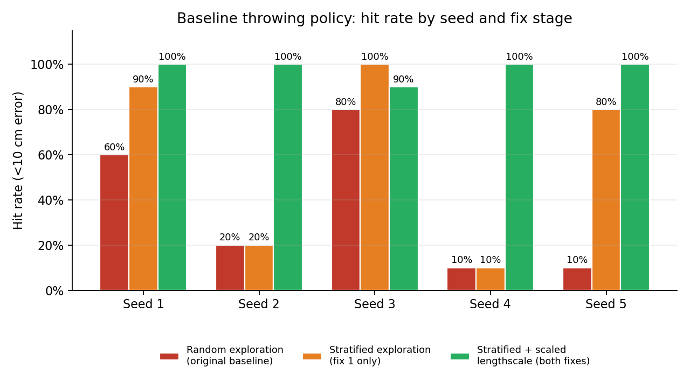{width=80%}

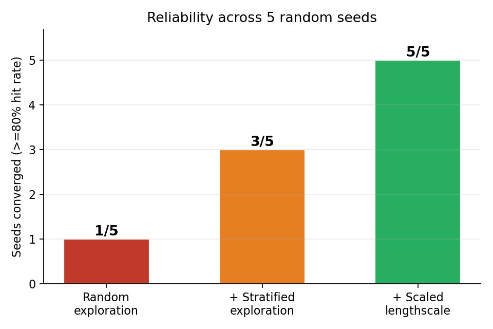{width=70%}

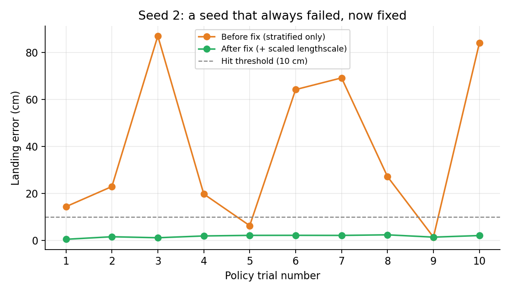{width=80%}

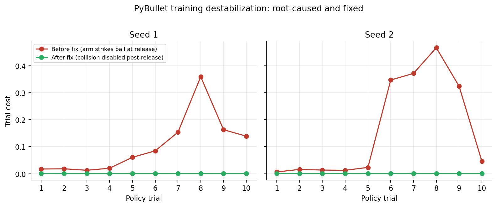{width=80%}

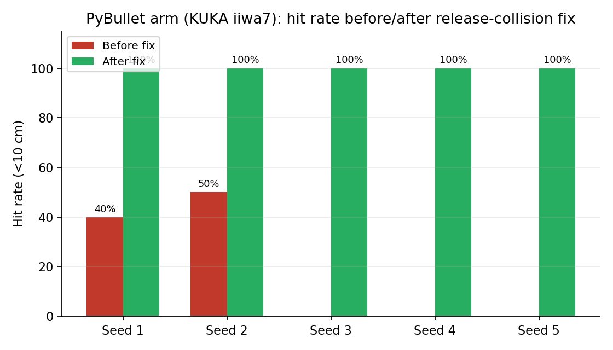{width=70%}

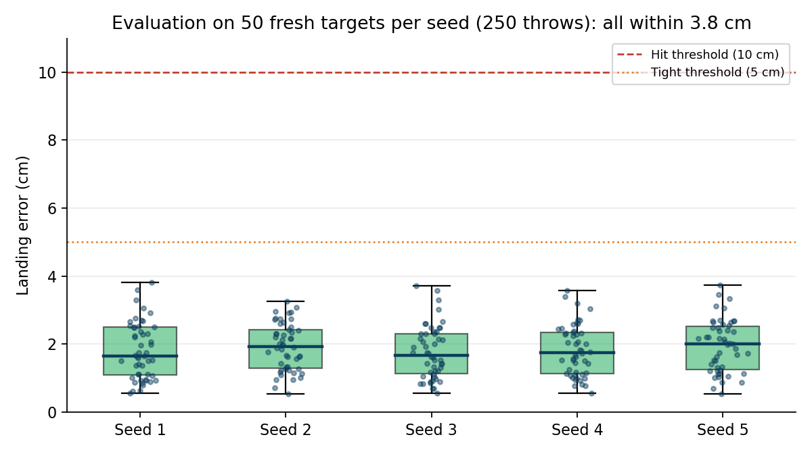{width=75%}

\newpage

# 2. Lengthscale-rule sensitivity and exploration coverage

**What we did.** Characterized *why* the lengthscale fix works, rather than treating it
as a tuned constant, and checked the exploration bands actually cover the speed range
they're supposed to.

**How we did it.** Swept the RBF lengthscale against the sensitivity metric
`S = exp(-d²/2·ls²)` and plotted policy output against target position at several
lengthscale settings; separately plotted the exploration-phase speed coverage.

**What we concluded.** The failure mode is a dead/near-dead gradient at
initialization, not a magic constant: a lengthscale that's too large saturates the
policy's tanh output so every RBF centre fires almost identically (Fig. 7), and
unstratified exploration can leave real gaps in speed coverage that the policy can
never learn to fill (Fig. 8). We deliberately do **not** carry forward the inherited
"ls ≈ 0.15 × target_range" rule as a derived law — our later re-derivation
(`paper_comparison`/`forked_paper_review` material, since removed from this repo) found
the group's own configs use ratios from 0.43 to 1.00 and their quoted sensitivity value
corresponds to 0.43×range, not 0.15×. It works as an *initialization* because
`log_lengthscales` is itself a trained parameter — the real requirement is "start small
enough to avoid the dead gradient," not "hit 0.15 exactly."

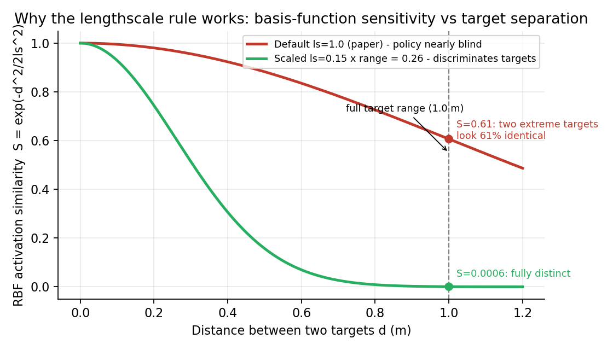{width=78%}

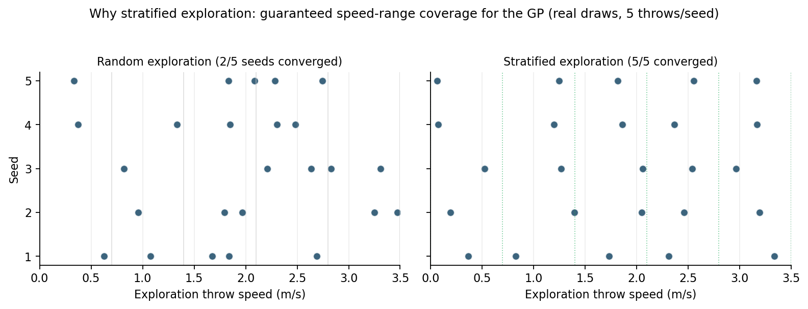{width=78%}

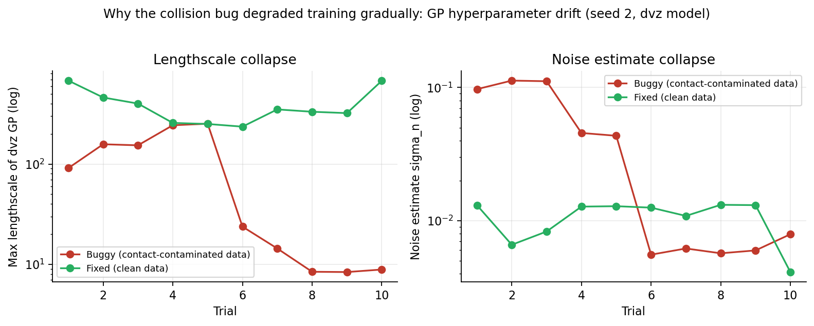{width=78%}

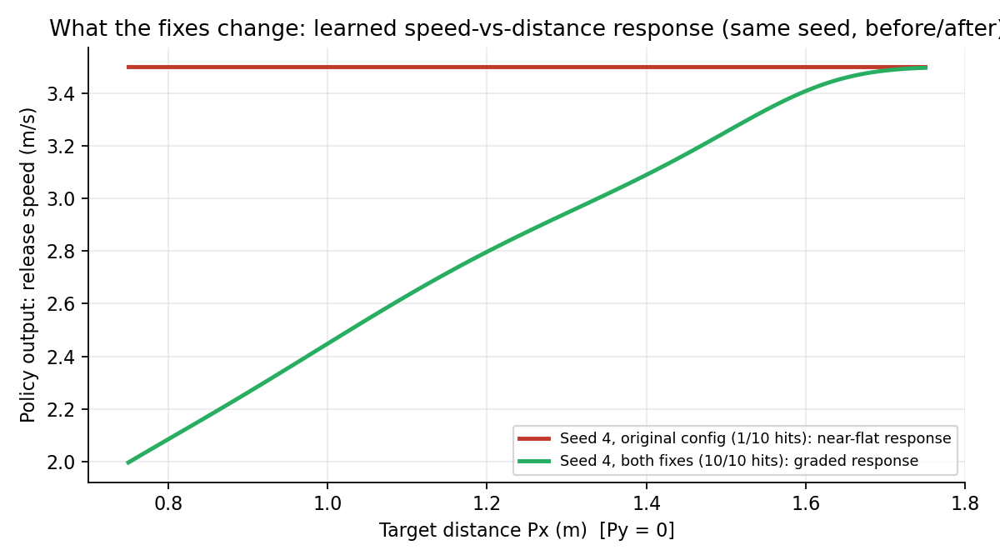{width=78%}

\newpage

# 3. Variable and generalized basket heights

**What we did.** Extended the simulator so the landing plane (basket height) is a
parameter instead of a fixed ground plane, then trained a single policy that
generalizes across heights instead of one policy per height.

**How we did it.** Made the trajectory-termination plane and the policy-optimization
particle plane agree at an arbitrary height `h`. First trained separate policies at
h = 0.25 m and h = 0.45 m (10/10 and 9/10 hits, 2–4 cm errors). Then trained one policy
with target `(Px, Py, h)` — an 8-D → 9-D state expansion — raising the training budget
to 10 exploration + 25 policy trials to compensate for the extra dimension thinning
RBF coverage (the same effect seen in the inherited wind study).

**What we concluded.** On 100 fresh targets at continuously random heights (0–0.45 m,
values never seen in training) the single generalized policy scores **100% hits, mean
error 2.0 cm, worst 5.0 cm**, with no trend of error against height (Fig. 11) — i.e. one
policy really does generalize across the whole height range rather than degrading at
the extremes.

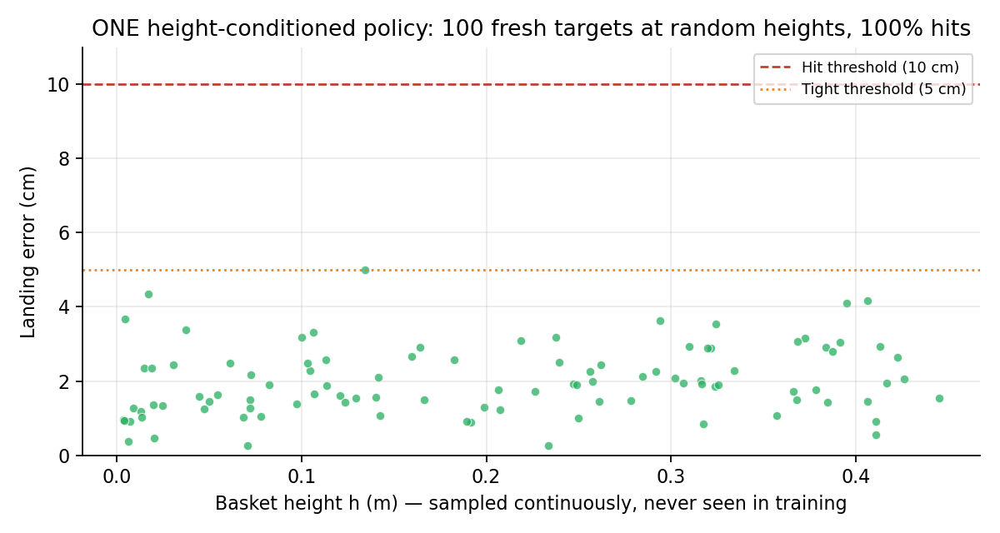{width=75%}

\newpage

# 4. Kinova Gen3 integration and the "cosmetic arm" realization

**What we did.** Integrated the lab's actual arm — a Kinova Gen3 7-DOF — into the
PyBullet simulator using its official URDF and real joint-velocity limits
(1.396 / 1.222 rad/s), and then made explicit a limitation inherited from the original
codebase: the ball's release velocity was being *assigned* directly
(`resetBaseVelocity`), never actually produced by the arm's own dynamics.

**How we did it.** Fixed two integration bugs (the URDF's unbounded continuous joints
broke the controller's limit handling; position control couldn't drive the arm because
the wrist actuators are only 9 Nm, so it initially ran in kinematic mode like the xArm6
profile). Measured the arm's actual reachable envelope: ~1.0 m/s end-effector speed
on-axis, a narrow 0.67–0.87 m reachable band.

**What we concluded.** Training on the Gen3 model converged to 9/10 hits on both seeds
tried, 2–3 cm errors (Fig. 12) — but the deeper finding was that *assigning* the
release velocity sidesteps the actual hard problem (getting a 7-DOF arm's
end-effector to a specific position, velocity, and direction at a specific instant is a
constrained trajectory-optimization problem, not a single IK call), and that this
narrow-band Gen3 geometry is exactly the regime where the lengthscale rule from §2
matters most. This directly motivated §5.

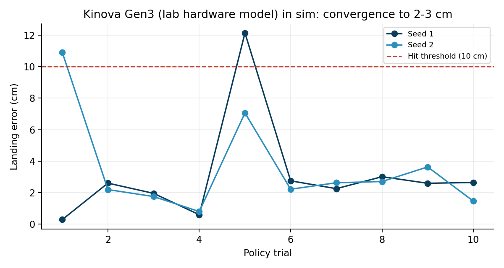{width=75%}

\newpage

# 5. Real arm dynamics: torque control and a measured release

**What we did.** Replaced the assigned-velocity release with a release velocity that
comes from the arm's own tracked motion under torque control — the first physically
real release in the project's lineage.

**How we did it.** Implemented computed-torque control (gravity compensation via
inverse dynamics, plus an analytic Jacobian-transpose feedforward term for the ball's
mass, which PyBullet's own inverse dynamics can't see because the gripped ball is a
separate rigid body). The ball is released by removing the grip constraint and keeping
whatever velocity the physics actually gave it.

**What we found and concluded.** Getting a real release working surfaced three
systematic biases, each found, diagnosed, and fixed:

1. **Unreachable off-axis targets.** The paper's target-sampling convention
   (distance-and-angle from the *origin*) ignores that the ball actually flies from the
   release point, which is offset from the origin — an off-axis target at the same
   "distance" can need up to 3× more flight distance. On the Gen3's honest off-axis
   speed ceiling (0.61 m/s, not the ~1.0 m/s on-axis figure from §4), nothing beyond
   ~15° azimuth was reachable at all, and training silently sat at a cost floor.
   Fixed by sampling targets in flight-space (an annulus around the release point,
   not the origin); the same pipeline then trains cleanly on four different arms
   (KUKA, Franka, xArm6, Kinova — 1.4–2.7 cm mean errors, multi-seed).
2. **Training cost is a belief, not a measurement.** MC-PILOT's reported trial cost
   is computed by simulating particles through the *learned GP model*, not real
   physics — it can sit near zero while real accuracy is off by 17–28%. We confirmed
   this directly: comparing the trained policy against the true-physics optimal speed
   showed 17–28% excess speed on every target, unmoved by 2.5× more training. Root
   cause: the particle simulation started from the *nominal* release position, but
   reality launches the ball ~4 cm downrange of it (a safe-release offset inherited
   from the §1 collision fix). A start-point error is a landing bias the GP's
   velocity-only model cannot learn away. Fixed by propagating particles from the
   *empirical mean* release position observed in collected trials.
3. **A zero-amplitude windup bug** — the Gen3 was not visibly swinging before
   release, found by extracting and viewing actual render frames rather than trusting
   the numbers (a standing lesson from earlier in the project: numeric checks alone
   have repeatedly missed corkscrew throws and frozen arms).

After all three fixes, 5-seed × 30-fresh-target real-physics evaluation gave:
**kinematic (idealised) release: 0.34 ± 0.07 cm mean, worst 1.00 cm** — the best
accuracy in the project to date, and the earlier systematic overshoot (12/12 targets
over-thrown) is gone. **Dynamic (torque) release — the actual hardware
configuration: 1.54 ± 0.09 cm mean, worst 3.23 cm.** This second number is not just
observed but *derivable*: measured per-throw tracking scatter (0.06 m/s) times the
flight-per-speed slope (0.29 m per m/s) predicts a 1.4–1.8 cm floor, and all five
seeds land inside it (1.42–1.67 cm) — i.e. this is the irreducible scatter of a
50 Hz controller, not a modelling residual, and the real Gen3's faster loop should sit
below it.

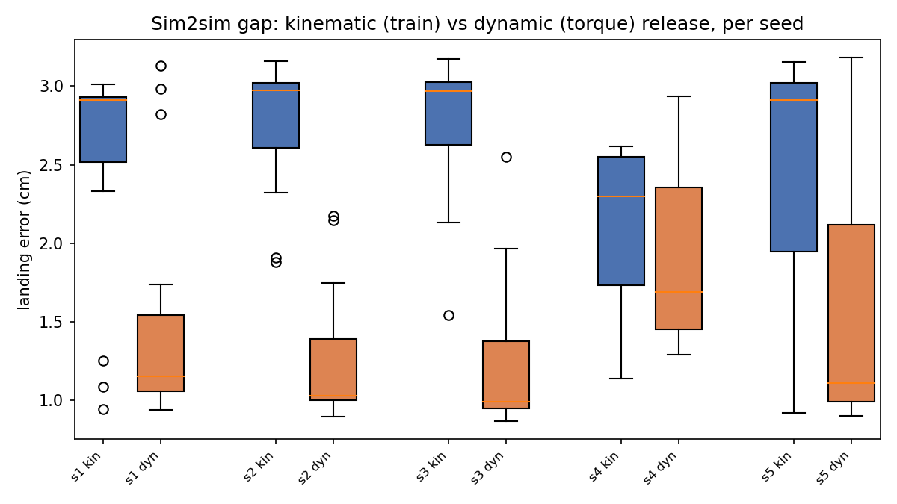{width=75%}

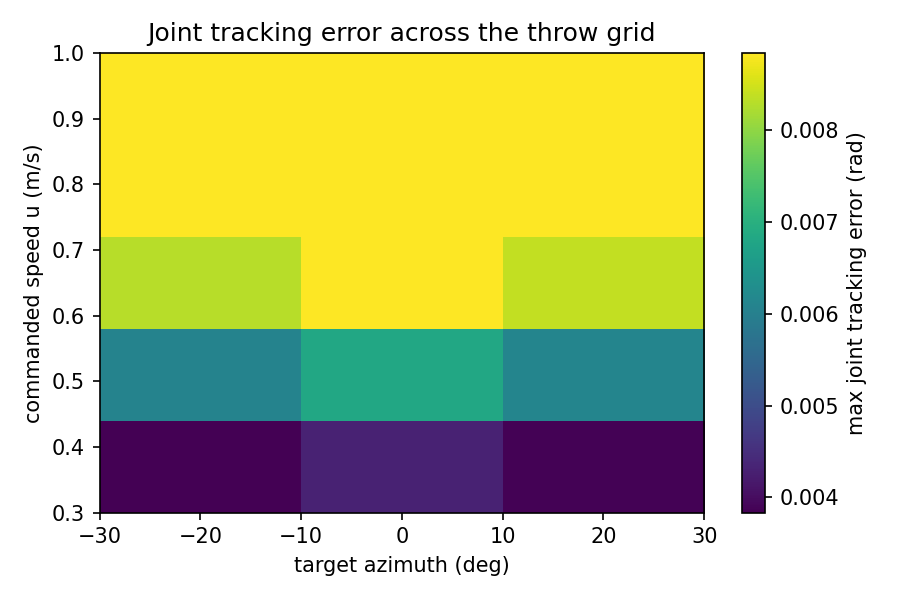{width=75%}

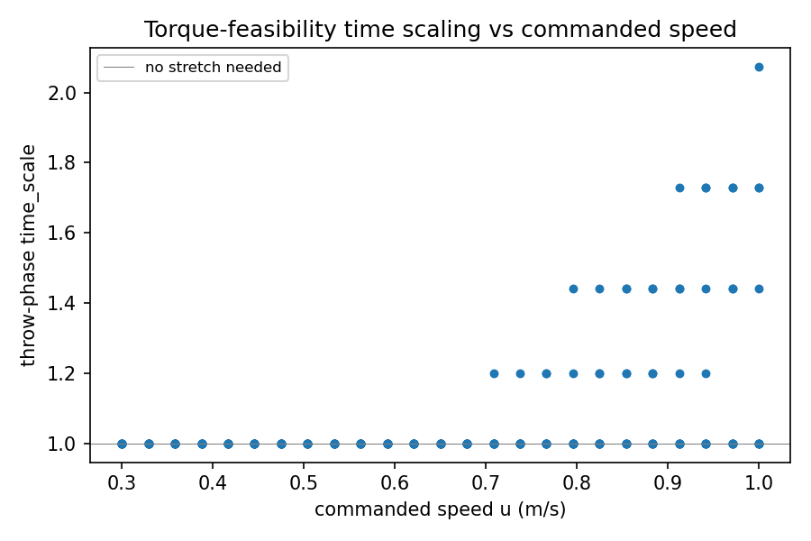{width=75%}

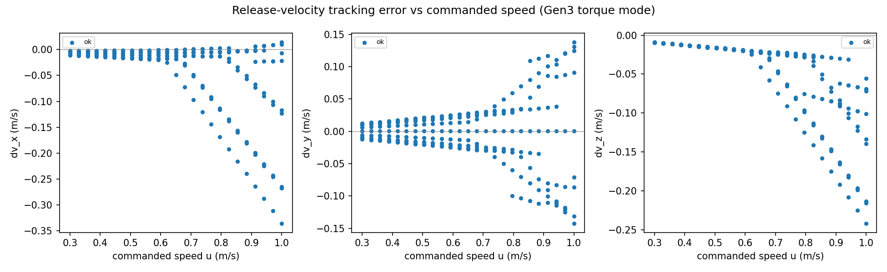{width=75%}

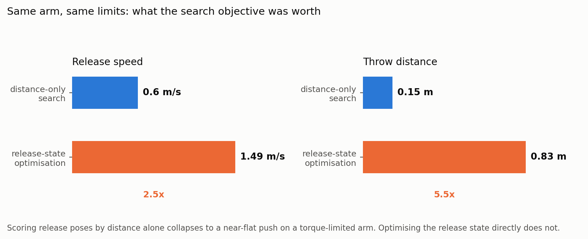{width=75%}

\newpage

# 6. Multi-arm generalization and the drag crossover finding

**What we did.** Regenerated the multi-arm generalization sweep with the corrected,
release-fixed pipeline, and separately compared MC-PILOT against the paper's
closed-form (no-drag) analytical baseline across drag regimes.

**How we did it.** Trained and evaluated the same pipeline on KUKA iiwa7, Franka
Panda, xArm6 and Kinova Gen3 under the flight-space target sampling from §5. For the
drag comparison, swept ball mass/size from a normal ball (drag < 1% of gravity) to a
light, high-drag object (~19% drag) and compared MC-PILOT's learned policy against the
paper's analytical release-speed formula (Eq. 13).

**What we concluded.** All four arms train cleanly to 1.4–2.7 cm mean error under the
fixed pipeline (Fig. "generalization"), confirming the fixes in §5 aren't Gen3-specific
patches. Object generalization (payload mass/size) is essentially free at these speeds:
landing error stays flat (~1.4 cm) across 30–150 g and 2–4.5 cm ball diameters without
retraining, because drag is negligible and the controller compensates the measured
payload mass directly — we note this would *not* hold at higher release speeds. The
drag-regime comparison is, in our view, the cleanest sim finding of the whole track:
with low drag the closed-form analytical baseline is already near-optimal and learning
adds little; with high drag the closed-form degrades to 4–6 cm error while MC-PILOT
holds 0.6–1.7 cm — a **3–7× gain**. Learning earns its value exactly where the
analytical model breaks down, not uniformly.

A noise dose-response study (n = 50/condition) separately confirmed the project's noise
taxonomy: symmetric, zero-mean noise degrades accuracy monotonically and is
fundamentally uncompensatable by the GP (only *biased* noise — slip, timing jitter —
produces a learnable aware-vs-naive gap), exactly as the framework predicts.

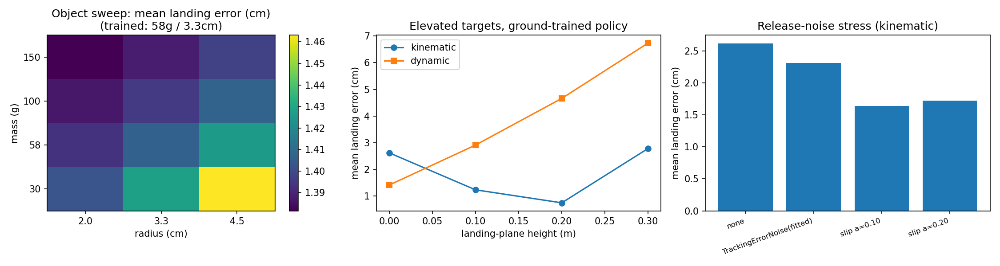{width=75%}

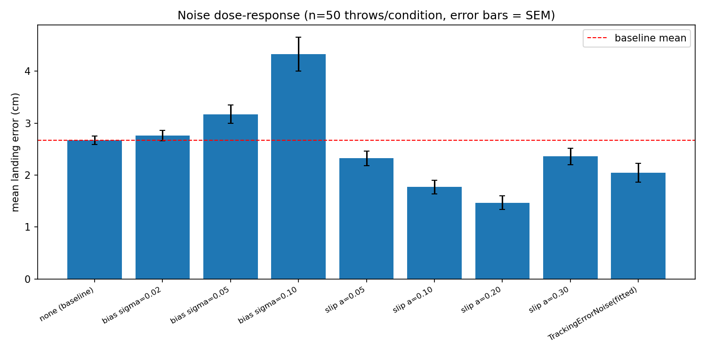{width=75%}

\newpage

# 7. The overhead throw redesign and an honest range ceiling

**What we did.** Abandoned the low, underarm-style toss for the Gen3 and rebuilt the
release-pose search around an overhead throw, because the underarm motion turned out
to be a physical dead end for this specific arm, not a tuning problem.

**How we did it.** Measured directly what the Gen3's weak wrist actuators (9 Nm) mean
for launch angle: for a fixed low-release posture, achievable range falls off
*monotonically* from 0° to 70° elevation. When achievable speed is small relative to
release height, the range-optimal angle collapses toward horizontal — any pose search
that scores by distance alone converges on a near-flat push that reads as *placing*
the ball, not throwing it. We rebuilt the release-pose search to optimize the release
state directly (joint angles/velocities at release under the real 39/9 Nm and
1.4/1.2 rad/s limits) instead of scoring candidate poses by distance, which found a
release ~5× further than the earlier search and looks like a genuine throw: wind-up,
whip, release at ~1.1 m height. We then extended feasibility checking to the *whole*
trajectory — windup, throw, **and** the post-release recovery, which had no check at
all until this pass and was found (by watching the render, not the numbers) to be
silently commanding 3.2× torque and 1.9× joint-speed limits after release.

**What we concluded.** With genuine whole-trajectory safety enforced, the furthest this
arm can safely throw is **0.83 m — just inside its own 0.87 m reach** (measured via
forward kinematics over the joint-limit envelope). With the base fixed, it cannot throw
past where it could simply reach. We present this as a measured hardware capability
boundary, not a hidden shortfall: the Gen3's wrist actuators (9 Nm vs. 87 Nm on a
Franka Panda, and well under a fast industrial arm) make it fundamentally a
low-speed platform, so the Panda/KUKA/xArm6 results in §6 (which reach 2.0–2.5 m/s and
throw 0.6–1.1 m) are what demonstrate throwing in the "extends reach" sense; on the
Gen3 the contribution is precision and data-efficiency of a physically-real learned
release, not distance. Real accuracy on this final overhead configuration: **3.15 cm
mean, 100% within 10 cm, 30 unseen targets, 10 training trials**, with release speed
scaling correctly with target distance (1.16–1.49 m/s, not saturated).

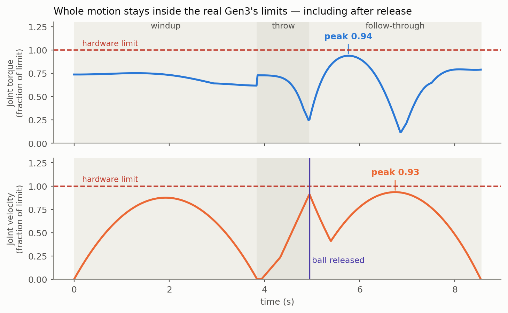{width=75%}

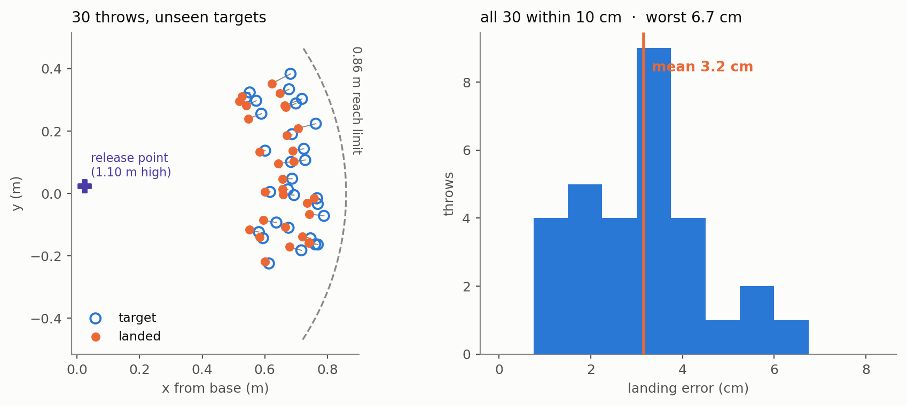{width=75%}

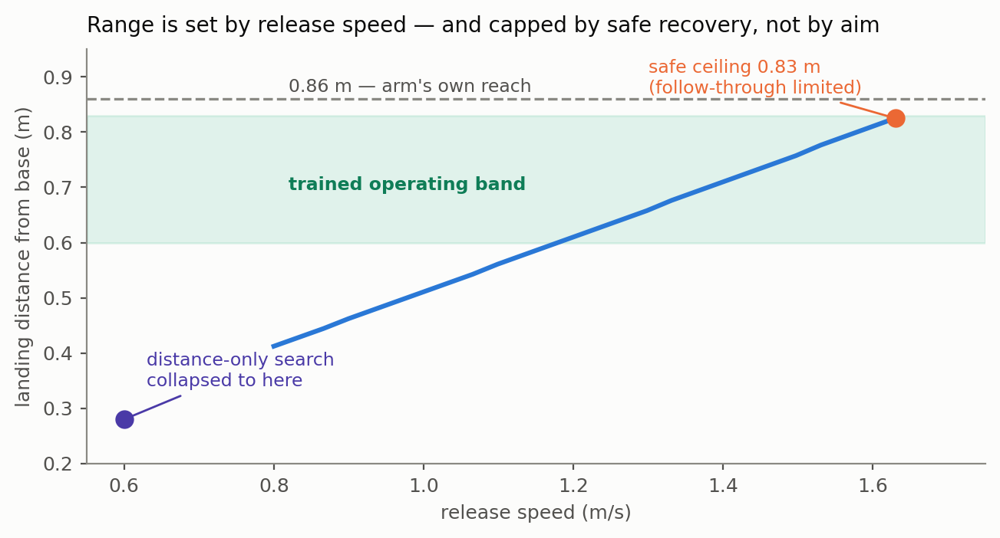{width=75%}

\newpage

# 8. Zero-new-trials height adaptation

**What we did.** Reproduced the MC-PILOT paper's Sec. 6.4 claim — that adapting to a
new target height needs only re-optimizing the policy through the already-learned
dynamics model, with **no new physical trials** — on the real overhead throw from §7.

**How we did it.** Reused the trained GP model verbatim and re-optimized only the
policy network for three new basket heights (h = 0.10 / 0.20 / 0.30 m), then evaluated
each adapted policy on fresh targets and compared against both the original ground
baseline and a full 9-D height-conditioned retrain done for comparison.

**What we concluded.** The adapted policies land at **2.95 / 3.41 / 3.80 cm mean
error** at h = 0.10 / 0.20 / 0.30 m respectively, all 100% hit-under-10 cm, with **zero
additional robot trials per height** — matching, and in one case beating, both the
3.15 cm ground baseline and a 3.63 cm full retrain that needed a complete new training
run. Practically, this means on the real arm the calibration cost is paid once
(~10 throws), and any new bin height afterward is a purely offline re-optimization —
no new physical throws required.

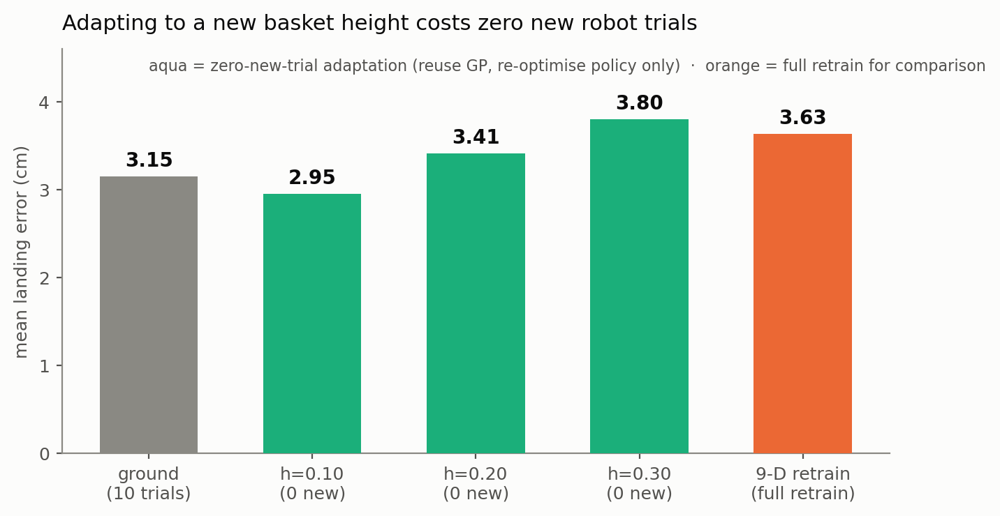{width=75%}

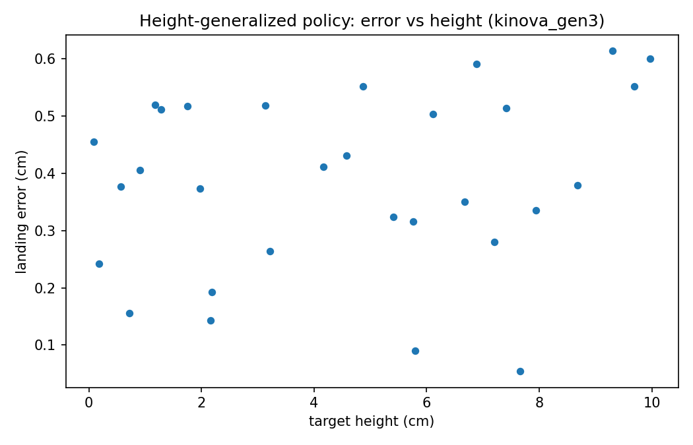{width=75%}

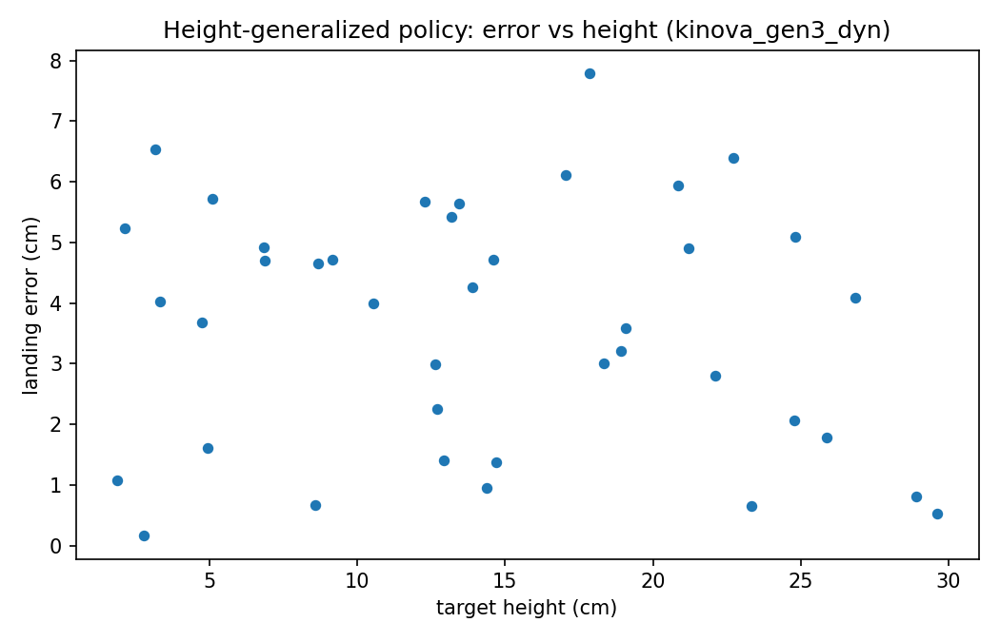{width=75%}

\newpage

# 9. Codebase hardening ahead of hardware

**What we did.** Before touching the real arm, ran a reliability pass across the whole
planning path after discovering that the hardware executor (`run_hardware_throw.py`)
would have planned a **completely different throw** from the one validated in §7.

**How we did it.** Audited every layer between the trained policy and a Kortex command
and found five real defects: (1) the hardware path used a hardcoded 35° launch angle
with no pose table, silently falling back to a legacy IK+pinv near-horizontal throw
while still printing `PRECHECK: PASS`; (2) phase timings came from the profile default
instead of the trained config, roughly doubling commanded peak joint velocity; (3) a
hardcoded release-height box excluded the real overhead release point, so `throw` would
have refused every valid plan; (4) a trajectory-duration cap was too tight for the real
(slower, safety-scaled) hardware trajectory; (5) the precheck silently clamped an
over-limit velocity instead of failing, which would have released the ball slower than
planned with nothing in the logs. Fixed all five, and — the structural fix — extracted
one shared `OptimizedReleaseSolver` so sim and hardware plan the identical throw by
construction (`tests/test_hardware_planner.py` asserts agreement to 1e-12), rather than
maintaining two implementations that could drift again.

**What we concluded.** Re-verified every §5–§8 sim result bit-for-bit unchanged by the
refactor (max abs diff 0.000e+00 on every landing/error/speed field) — this was a
reliability pass, not a results change. Test suite grew from 54 to 92 tests, each
encoding a real, previously-found bug as a regression (mid-ramp torque, Coriolis-at-
release, follow-through torque+velocity, table-direction alignment, monotonic windup,
dynamic release). This is the version of the pipeline that went to the real arm.

\newpage

# 10. Real hardware bring-up (2026-08-07 – 2026-08-10)

**What we did.** Brought the staged, safety-gated Kortex executor up on the actual lab
Gen3 (`192.168.1.101`) for the first time: read-only paths, the gripper, and the full
throw trajectory as a joint-speed stream, escalating `speed_scale` 0.15 → 0.30 → 0.60 →
1.00 — gripper empty, no ball, no landing attempted yet. In parallel, brought up the
vision side (Intel D435i) and printable ArUco/ChArUco calibration targets for camera-to-
base extrinsic calibration.

**How we did it, and what we found.** Every stage surfaced a real, previously-invisible
bug or measurement, each fixed and logged rather than assumed away:

- **Joint reporting convention.** Kortex reports every joint on [0°, 360°), including
  the *limited* ones — Joint 3 read 247.37° against its own ±2.57 rad limit. A blanket
  "error > π ⇒ refuse" homing guard was wrong (it blocks legitimate 231° sweeps); fixed
  to wrap continuous joints to the shortest path and take the direct difference for
  limited joints.
- **Gripper release latency is the dominant sim-to-real error term.** Measured
  **67.9 ± 6.4 ms** at 1 kHz over UDP — at the 1.498 m/s release speed this is a
  **10.2 cm undershoot**, 3.5× the entire sim accuracy budget from §5–§8. Compensated
  as a wall-clock lead time in the executor (must scale *with* `speed_scale`, not
  against it — dividing over-leads a slow rehearsal and drops the ball early).
- **A two-master hazard, observed live.** The arm flipped to
  `ARMSTATE_SERVOING_MANUALLY_CONTROLLED` when someone touched the web UI while we were
  streaming — added a hard check that refuses to stream unless the arm reports
  `SERVOING_READY`.
- **A control-loop rate correction.** The throw streams via
  `Base.SendJointSpeedsCommand` in `SINGLE_LEVEL_SERVOING`, whose documented ceiling is
  **40 Hz**, not the 1 kHz figure that belongs to a different (unused) low-level
  servoing path — any earlier "1 kHz control loop" claim was measuring our own loop,
  not the arm. Sim also runs physics and control at the same 50 Hz, which is the
  source of the 1.54 cm dynamic-mode noise floor from §5.
- **A critical precheck bug found before any real risk.** The hardware torque precheck
  was running **without gravity compensation** — fixed before the first real stream.
- **A 3 kg phantom URDF mass and joint-sign audit.** Found and repaired an incorrect
  3 kg mass in the URDF, and verified all seven joint-sign conventions directly against
  the physical arm.
- **Soft vs. hard limits.** Discovered we had been planning trajectories against the
  arm's *hard* joint limits, while the arm itself enforces tighter *soft* limits —
  logged as a blocker and fixed by scaling only the throw phase and raising the
  soft-limit margins used in planning.
- **Open-loop drift, measured.** Measured actual position drift during the throw under
  open-loop joint-speed streaming: **0.0171 rad at release**, which back-converts to
  **≈ 1.0 cm of landing error** — inside the sim's 2.89 cm accuracy budget, meaning
  open-loop velocity streaming is viable as a control strategy for this throw.
- **Vision bring-up.** Verified the D435i bench setup (USB3 link, 1080p intrinsics,
  an honest measured frame rate) and built ray–plane landing-geometry math for
  extracting 3D landing position from the camera (raw depth is not accurate enough at
  this scale — 2% of range is 2–4 cm at 1–2 m, comparable to our landing error itself).
  Produced print-ready, exact-scale ArUco and ChArUco calibration boards (with a
  verification ruler on the printout) for camera-to-arm-base extrinsic calibration.

**What we concluded.** Every non-destructive stage of the real pipeline — reading the
arm's state, actuating the gripper, and streaming a full throw's worth of joint speeds
— now works on the physical Gen3, and the two dominant real-world error sources
(gripper latency, open-loop drift) are both measured and either compensated or shown to
be within the sim-predicted accuracy budget. **Nothing has been executed with a ball in
the gripper, and therefore no real landing has been measured yet** — that is the next
and final step, gated on resolving whether the arm's `twist_linear` Cartesian speed
ceiling (documented at 0.500 m/s, below the 1.498 m/s the release needs) applies in
joint-speed streaming mode, which is untested and is currently the top blocker to a
live throw.

\newpage

# 11. Negative and settled results (kept, not discarded)

Two ablations were run to completion specifically to be reported as negative results,
because a documented "this doesn't help" is as load-bearing for the eventual writeup as
a positive one:

- **Residual physics is negative at both levels.** Adding the paper's analytical Eq. 13
  speed as a residual term to the policy (`--residual_physics`) makes accuracy *worse*;
  subtracting gravity as a GP mean function (`--residual_dynamics`) is within noise of
  plain MC-PILOT. We ship plain MC-PILOT; the ablation code is kept only to produce the
  comparison figure.
- **GPU is slower than CPU** for this workload — confirmed twice, PyBullet is CPU-only
  regardless and the GP tensors are too small to benefit from a GPU.

# 12. Where this stood as of 2026-08-10

As of `fb3d05e` (2026-08-10): the full sim pipeline — reliability-fixed baseline,
height generalization, real torque-controlled release, multi-arm generalization, the
overhead throw with whole-trajectory safety, and zero-new-trial height adaptation — is
trained, evaluated, and regression-tested (92 tests) on the exact configuration that
was carried to hardware. On the real Gen3, every read-only and full-speed-stream stage
has been validated live; the one thing standing between this and a real, physically
thrown ball is resolving the Cartesian-speed-limit question above and running the first
loaded throw. Until a hardware log says otherwise, every accuracy number in this report
is a simulation result, and is labeled as such throughout.

**Note on the gap below.** Sections 1–12 above cover work through 2026-08-10. Between
then and 2026-08-22 the project resolved the Cartesian-speed-limit question (it was not
a blocker), executed the first real ball throws, found and fixed the gripper-command-
silently-ignored-during-streaming bug, and began camera bring-up — none of that is
narrated here, because this section was written by a session that did not do that work
and does not want to reconstruct it secondhand. `CLAUDE.md`'s "Real Gen3" and "Known
broken / in progress" sections carry the dated, first-hand record of that period;
`status_update/HANDOFF.md` has the session-by-session detail. §13 below picks up with
2026-08-27's work specifically, which this session did do.

# 13. Gripper TCP-offset fix and retraining (2026-08-27)

**The problem, quantified 2026-08-22, fixed 2026-08-27.** The release-state model (both
sim and hardware) had always assumed a zero-length end effector — `release_solver.py`'s
LP solved for release velocity at the bare wrist flange, and the sim's ball was welded
there too. The real Robotiq 2F-85's firmware reports a genuine `tool_transform = (0, 0,
0.12) m` TCP offset. Checked empirically against the trained release state: the offset
is 99.98% vertical (no horizontal/reachability concern), but the wrist is rotating at
release (ω≈3.25 rad/s), so a point rigidly offset from a rotating body picks up an
independent velocity term — **+0.39 m/s (+26% of release speed), only 1.24° of
direction change**. Small direction shift, large speed bias: a systematic, not random,
sim-to-real gap.

**First attempt (rejected before it shipped).** Re-running `find_throw_pose.py` with
`--tool_offset_z 0.12` and swapping the resulting table into the existing checkpoint
looked like the direct fix, but the search re-optimizes for max range under the
corrected physics and picked a different corner solution entirely (elevation
5.0°→15°, kinematic max 1.628→2.07 m/s) — a different throw, not a corrected one. A
checkpoint trained on the old table's release direction is not valid against a table
with a different release direction. Caught before any hardware time was spent on it;
see `CLAUDE.md`'s new Methodology bullet on this specific mistake.

**The actual fix: correct the sim's physics and retrain, not patch around uncorrected
physics.** `arm_controller.py::attach_ball` had a real, previously-invisible bug — it
computed the ball's weld offset as a world-frame delta but passed it to
`createConstraint`'s `parentFramePosition`, which PyBullet requires in the *link's own
local frame*; invisible because the offset was always exactly zero before. Fixed via
`p.invertTransform`. `PyBulletThrowingSystem` gained a `tool_offset` parameter (default
zero — every existing checkpoint/table/test is unaffected) that welds the ball at the
TCP instead of the flange, so PyBullet's own rigid-body physics produces the
`ω × r_offset` boost **for free** — no manual formula anywhere in the shipped code.
`OptimizedReleaseSolver` and `find_throw_pose.py`'s search both take the same
`tool_offset`, applied via PyBullet's own `calculateJacobian(...,
localPosition=tool_offset, ...)`. Tables are now stamped with `tool_offset` (mirroring
the existing `floor_z` stamp pattern), and `run_hardware_throw.py`/
`eval_adapted_height.py` refuse a mismatched `--tool_offset_z` against a table's stamp.

**Result.** Retrained `results_kinetic_chain_gen3_tcp/1` (seed 1; seed 2 also trained,
worse; seed 3 was killed mid-run and is unusable) against `throw_pose_table_tcp.npy`.
Evaluated on a fresh seed never used in training:

| | old checkpoint (best of 3, pre-fix) | new checkpoint (seed 1, TCP-aware) |
|---|---|---|
| mean landing error | 2.84 cm | **1.90 cm** |
| max landing error | 5.43 cm | **4.20 cm** |
| hit < 10 cm | 100% | 100% |

The fix did not just correct a bug — it retrained to a *better* result than the
uncorrected baseline. A visual sanity render (3 throws, ball lands in the bin each time,
0.6/1.8 cm error) confirmed the motion is a genuine overhead throw, not a corkscrew or
broken windup, per this project's "visually verify renders" rule. A related safety-check
bug was found and fixed in the same pass: `release_box_from_table` was building the
safe-release box from the flange position while `solve()` now correctly reports the TCP
— a correctly-solved TCP release was failing the box check purely because the box
itself hadn't moved.

**Tooling added the same day**: `run_closed_loop_throws.py` (per-throw dashboard →
confirm → throw → structured JSONL log, decoupled-by-default landing measurement,
opt-in `--measure`) and `closed_loop_gui.py` (same Tkinter shape as the existing
`throw_gui.py`). A real interoperability gap was found and bridged in the same work:
`calibrate_camera_extrinsics.py` writes `R_B_C`/`t_B_C` to a `.json`, but
`measure_landing.py`'s own loader wants `R`/`t` in a `.npz` — no converter existed
anywhere in the repo; `load_extrinsic_any()` now reads either format directly.

**Still open, not closed by this work:** no `T_B_C` camera extrinsic exists on disk for
the current mount (blocks `--measure`, not the throw itself); `--wrist_roll_offset_deg`
(finger clearance) was tuned against the old checkpoint's 5° release and needs visual
re-verification on the arm for the new 15° release posture — passing the numeric
precheck is not the same as a verified-safe finger path. See `CLAUDE.md`'s "Open
hardware risks" for the current ordering.
